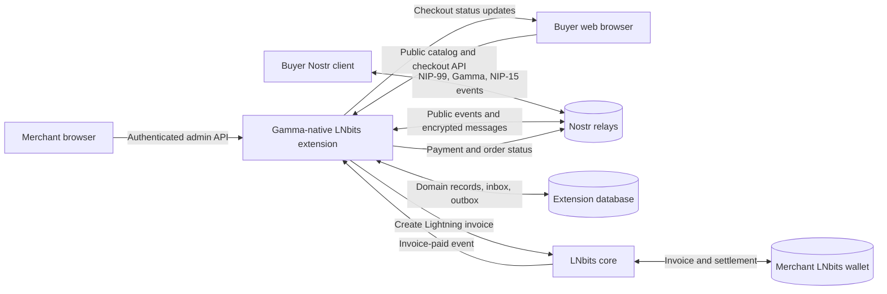
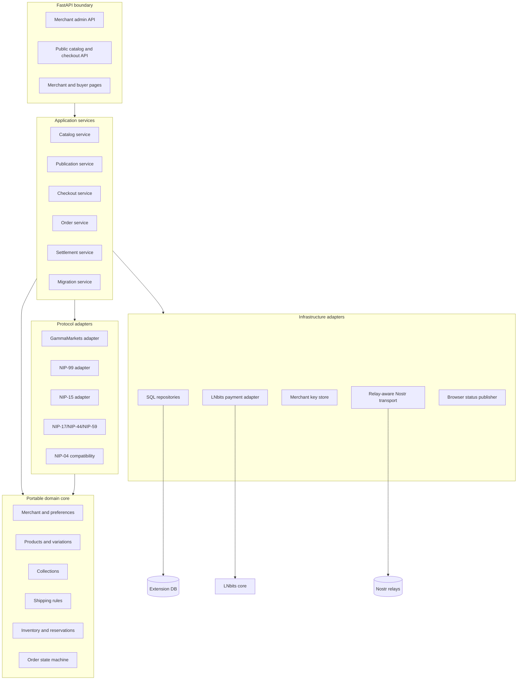
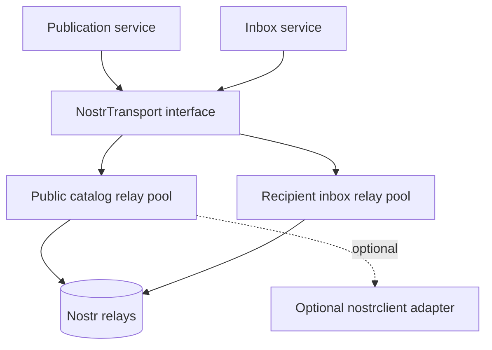
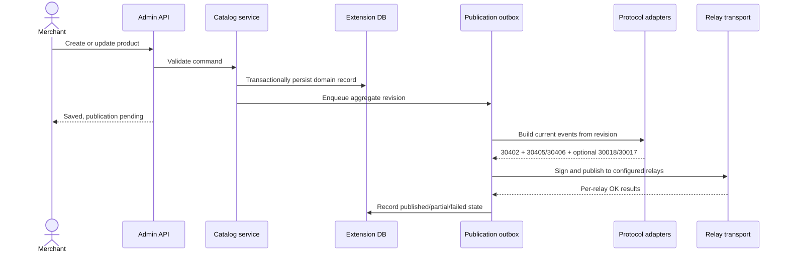
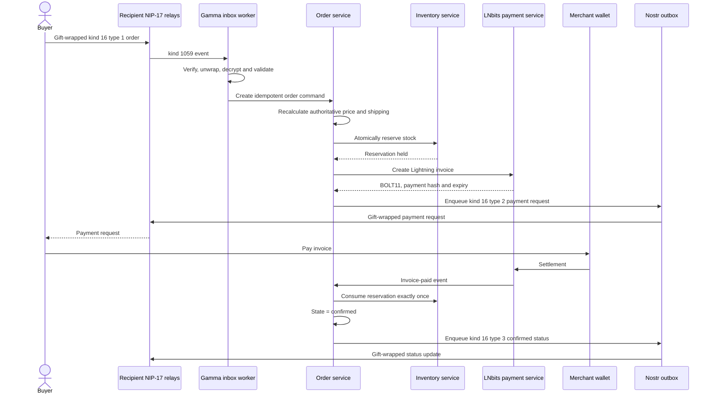
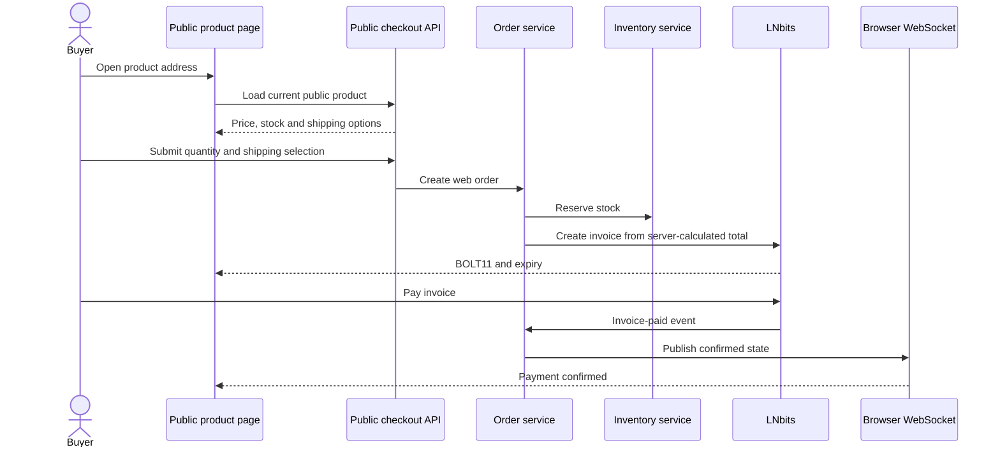
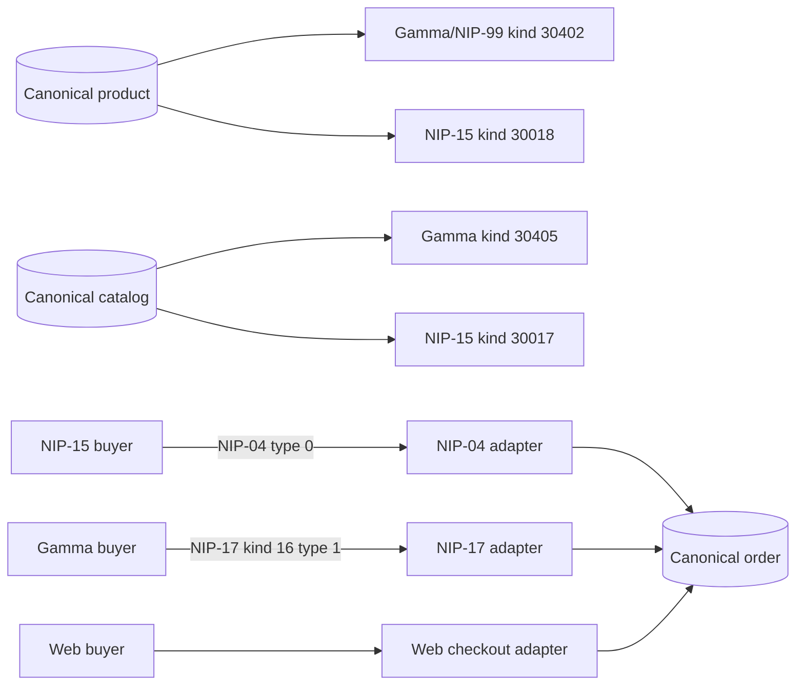
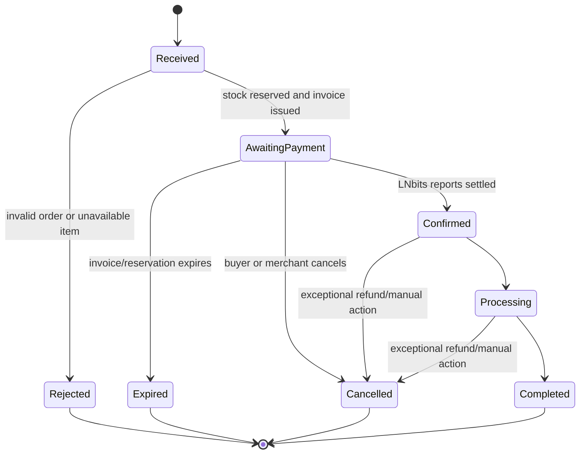
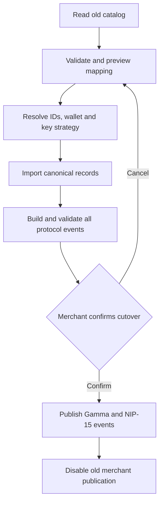
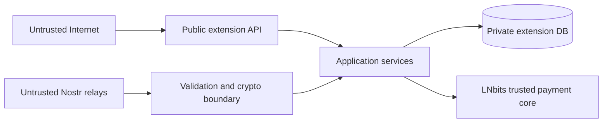

# Gamma-Native Commerce Extension for LNbits

## Architecture and Implementation Proposal

**Status:** Draft for design review  
**Working extension ID:** `gammamarket`  
**Implementation:** Standard Python LNbits extension  
**Primary protocol:** GammaMarkets marketplace protocol  
**Compatibility protocols:** NIP-99 Classified Listings and NIP-15 Nostr Marketplace  
**Payment backend:** LNbits wallets and Lightning invoices  
**Protocol references:**

- [GammaMarkets market specification](https://github.com/GammaMarkets/market-spec/blob/main/spec.md)
- [NIP-99 Classified Listings](https://github.com/nostr-protocol/nips/blob/master/99.md)
- [NIP-15 Nostr Marketplace](https://github.com/nostr-protocol/nips/blob/master/15.md)
- [NIP-17 Private Direct Messages](https://github.com/nostr-protocol/nips/blob/master/17.md)
- [NIP-44 Encrypted Payloads](https://github.com/nostr-protocol/nips/blob/master/44.md)
- [NIP-59 Gift Wrap](https://github.com/nostr-protocol/nips/blob/master/59.md)
- [NIP-89 Recommended Application Handlers](https://github.com/nostr-protocol/nips/blob/master/89.md)

---

## 1. Executive Summary

This proposal recommends building a new Gamma-native Python extension for LNbits rather than making GammaMarkets a secondary feature of the existing NIP-15 `nostrmarket` extension.

The new extension will:

1. Model products, collections, shipping, inventory, orders, payments, and fulfillment independently of any Nostr event format.
2. Publish complete NIP-99/GammaMarkets representations as the primary protocol output.
3. Publish NIP-15 stalls and products as a compatibility projection for existing NIP-15 clients.
4. Accept both GammaMarkets NIP-17 orders and legacy NIP-15 NIP-04 orders.
5. Use LNbits wallets to create Lightning invoices and LNbits payment events as the authoritative source of payment settlement.
6. Maintain durable Nostr subscriptions and relay reconnection through Python background tasks.
7. Support migration from an existing `nostrmarket` catalog without allowing two extensions to remain simultaneous inventory authorities.
8. Keep payment, transport, signing, and storage behind interfaces so the protocol core can later run outside LNbits or be partly compiled to WASM.

The extension will be a new commerce system, not a thin NIP-99 publisher. The distinction matters because GammaMarkets includes merchant preferences, collections, shipping, encrypted order communication, payment requests, payment receipts, and order-status messages in addition to product listings.

### Recommended architectural decision

Build a standard Python LNbits extension with a portable domain core and a direct, relay-aware Nostr transport based on `nostr-sdk`. Retain an optional `nostrclient` transport adapter for public catalog fan-out, but do not make the current `nostrclient` extension a hard dependency for NIP-17 delivery until it supports recipient-specific relay routing.

### Why Python rather than the current LNbits WASM runtime

Python extensions can run permanent background tasks, maintain durable relay connections, perform transactional inventory updates, use normal database migrations, and process Nostr orders while the merchant UI is closed. The current WASM runtime invokes bounded functions and does not provide a long-lived socket or daemon lifecycle.

---

## 2. Motivation

### 2.1 The marketplace ecosystem has moved beyond NIP-15

NIP-15 was an important early Nostr commerce protocol. It established:

- merchant identities;
- stalls (`kind:30017`);
- products (`kind:30018`);
- structured NIP-04 order messages;
- Lightning payment requests;
- paid and shipped status messages.

However, the canonical NIPs repository now marks NIP-15 as:

- `draft`;
- `optional`;
- `unrecommended`;
- too complicated for new implementations, with NIP-99 suggested as the alternative.

That does not make NIP-15 useless. Existing NIP-15 merchants and clients remain valuable. It does mean that new development should avoid making the NIP-15 stall and message model the permanent center of the architecture.

### 2.2 NIP-99 improves discovery but is not a complete checkout protocol

NIP-99 defines the addressable `kind:30402` classified listing. It is intentionally broad enough for products, services, jobs, rentals, giveaways, and other offers.

NIP-99 standardizes lightweight listing metadata such as:

- stable `d` identifiers;
- title and summary;
- Markdown content;
- price and currency;
- images;
- categories;
- location;
- active or sold status.

NIP-99 alone does not define a complete merchant application, inventory system, shipping calculation, invoice workflow, or order-status protocol.

### 2.3 GammaMarkets supplies the missing commerce layer

The GammaMarkets specification uses NIP-99 product listings as its foundation and adds the structures needed for interoperable commerce:

- product collections (`kind:30405`);
- shipping options (`kind:30406`);
- product types and variations;
- stock and visibility;
- merchant application preferences through NIP-89;
- merchant payment preferences through kind `0`;
- NIP-17 encrypted order communication;
- order, payment-request, status, shipping, and receipt messages;
- optional product reviews.

This creates a practical path to a marketplace where the listing, merchant preferences, order messages, and payment proofs can be understood by independent clients.

### 2.4 Why not continue using only NIP-15?

Using only NIP-15 would preserve existing behavior but leave several structural problems unresolved.

| Concern | NIP-15-only result | Gamma-native result |
|---|---|---|
| Ecosystem direction | Builds further on an unrecommended draft | Aligns with NIP-99 and its linked commerce extension |
| Product discovery | Limited to NIP-15 marketplace clients | Visible to NIP-99 clients and Gamma marketplaces |
| Product representation | JSON content tied to a stall | Addressable listing with searchable structured tags |
| Collections | Stall is the primary grouping | Independent, referenceable collections |
| Shipping | Embedded stall zones and product surcharges | Independent addressable options and collection references |
| Product variations | No standard representation | Variable and variation product relationships |
| Merchant preferences | No application-handler negotiation | NIP-89 application and kind-0 payment preferences |
| Private messages | NIP-04 leaks sender/receiver metadata | NIP-17 uses NIP-44 and NIP-59 gift wrapping |
| Payment receipts | Not standardized | Structured kind-17 receipt rumors |
| Fulfillment state | Primarily paid/shipped booleans | Pending, confirmed, processing, completed, cancelled, and shipping states |
| Extensibility | New features must be added to NIP-15 JSON | Structured tags and addressable supporting events |

### 2.5 Why preserve NIP-15 compatibility?

NIP-15 compatibility remains worthwhile because:

- the existing LNbits `nostrmarket` extension implements it;
- existing clients can display `30017` and `30018` events;
- deployed merchants already have NIP-15 identities and product identifiers;
- a migration that immediately abandons old clients would reduce reach;
- publishing a compatibility representation is less costly than maintaining two independent catalogs.

The extension should therefore treat NIP-15 as a compatibility adapter, not as a second source of truth.

---

## 3. Pre-Existing Work

The proposed extension should reuse proven concepts and code patterns but should not inherit the old extension's domain model unchanged.

### 3.1 LNbits core

LNbits already provides:

- account and wallet ownership;
- Lightning invoice creation;
- invoice payment events;
- wallet APIs;
- FastAPI routing;
- extension databases and migrations;
- extension startup and shutdown hooks;
- internal browser WebSockets;
- authentication dependencies;
- exchange-rate utilities;
- host-configured SMTP email sending (`core/services/notifications.py`).

This removes the need to build a wallet server or Lightning accounting system.

### 3.2 Existing `nostrclient` extension

`nostrclient` is already separate from `nostrmarket`. It provides:

- persistent connections to administrator-configured relays;
- `REQ`, `EVENT`, and `CLOSE` message transport;
- subscription ID rewriting;
- relay reconnection and health monitoring;
- event aggregation and deduplication;
- a local WebSocket endpoint used by other extensions.

Its current limitation for complete GammaMarkets support is relay selection. NIP-17 requires publishing gift wraps only to the recipient's kind-10050 inbox relays. The current `nostrclient` relay manager primarily fans messages out to its configured relay pool and does not expose per-publication target relay sets through a user-scoped service API.

### 3.3 Existing `nostrmarket` extension

`nostrmarket` provides useful reference implementations for:

- merchant key generation and signing;
- NIP-15 stall and product serialization;
- NIP-04 encryption and structured messages;
- product, zone, order, and customer persistence;
- LNbits invoice creation;
- invoice-paid processing;
- permanent background tasks;
- communication with `nostrclient`.

It also exposes architectural limitations that the new design should address:

- the domain model is centered on NIP-15 stalls;
- private keys are stored directly in the merchant table;
- order state is largely represented by `paid` and `shipped` booleans;
- inventory is decremented after payment without a complete reservation mechanism;
- NIP-04 and NIP-15 semantics are embedded directly in models and services;
- products, protocol events, and persistence concerns are closely coupled.

### 3.4 Existing WASM work and `paidtasks`

The `paidtasks` sample demonstrates the intent behind sandboxed extensions and public invoice creation. The current checked-out sample uses an older WASM ABI and is not an appropriate direct template for a new Python extension.

Useful lessons from the WASM work still apply:

- request minimal capabilities;
- isolate public checkout from merchant administration;
- scope invoice creation to known merchant-owned records;
- keep payment correlation explicit;
- publish browser updates without exposing wallet credentials.

### 3.5 Existing research in this repository

The companion files provide historical context:

- [`research.md`](./research.md)
- [`proposal.md`](./proposal.md)

This proposal (the one you are reading) supersedes the browser-relay transport recommendation in `proposal.md`, because the current WASM iframe CSP blocks direct network connections.

---

## 4. Goals and Non-Goals

### 4.1 Goals

The first production release should:

1. Provide a complete GammaMarkets merchant implementation for Lightning payments through LNbits.
2. Publish valid NIP-99 product listings.
3. Publish GammaMarkets collections, shipping options, and merchant preferences.
4. Receive and send GammaMarkets NIP-17 order messages.
5. Publish NIP-15 compatibility stalls and products.
6. Receive NIP-15 NIP-04 orders for compatibility.
7. Maintain one authoritative product, inventory, order, and payment model.
8. Process orders and payments while the merchant UI is closed.
9. Provide public product and checkout pages.
10. Support migration from an existing `nostrmarket` merchant.
11. Preserve stable Nostr addresses across updates.
12. Provide protocol conformance fixtures and deterministic adapter tests.
13. Notify merchants and customers of order events by email through the host's configured SMTP transport.

### 4.2 Non-goals for the first release

The initial release should not attempt to:

- become a hosted multi-tenant marketplace independent of LNbits;
- provide fiat custody or card processing;
- provide escrow or dispute arbitration;
- implement every optional product-review feature;
- translate arbitrary NIP-15 stalls from unrelated merchants into Gamma events;
- keep two extensions as simultaneous writers for one catalog;
- guarantee delivery through relays without exposing delivery state;
- silently claim compatibility with future GammaMarkets draft revisions;
- support multiple merchants sharing one product or inventory record;
- implement a general-purpose Nostr key-management service for other extensions.

---

## 5. Design Principles

### 5.1 Domain model before protocol model

Products and orders are commerce entities. They should not be stored as serialized Nostr events. Protocol adapters generate events from domain records and ingest events into domain commands.

### 5.2 GammaMarkets is primary

When GammaMarkets and NIP-15 differ, the internal model should preserve the richer Gamma semantics. NIP-15 output may be lossy, but Gamma output must not be constrained by NIP-15.

### 5.3 Exactly one writer per catalog

One extension must own inventory, invoice creation, and publication for a merchant catalog. Migration from `nostrmarket` must include an explicit cutover.

### 5.4 Payment truth comes from LNbits

A buyer-provided amount or Nostr payment receipt is not proof that the LNbits invoice was paid. LNbits payment state is authoritative for Lightning settlement.

### 5.5 Relays are eventually consistent transport

Publishing an event is not an atomic database operation. The extension must use an outbox, record relay acknowledgments, retry failures, and tolerate duplicates.

### 5.6 Protocol revisions are explicit

The GammaMarkets specification is a draft. The extension must pin a tested specification revision and expose it in settings and generated event metadata where appropriate.

### 5.7 Security boundaries are explicit

Merchant keys, wallet identifiers, invoice metadata, shipping addresses, and decrypted messages must never be returned from public routes or written to logs.

### 5.8 Compatibility is testable

"Compatible" must mean that fixture events pass validators and that cross-client flows are exercised. It must not be based only on matching event-kind numbers.

---

## 6. System Context



The extension is the commerce authority. LNbits remains the wallet and Lightning settlement authority. Nostr relays provide discovery and message transport but are not authoritative storage for inventory or payments.

---

## 7. Component Architecture



### Dependency rule

Dependencies point inward:

```text
routes/tasks → application services → domain
                                  ↘ protocol and infrastructure interfaces
```

The domain layer must not import FastAPI, LNbits, SQL, `nostr-sdk`, or UI code.

---

## 8. Proposed Package Structure

```text
gammamarket/
├── __init__.py
├── config.py
├── dependencies.py
├── views.py
├── views_api.py
├── tasks.py
├── migrations.py
├── crud.py
├── domain/
│   ├── merchant.py
│   ├── catalog.py
│   ├── product.py
│   ├── collection.py
│   ├── shipping.py
│   ├── inventory.py
│   ├── order.py
│   ├── payment.py
│   └── errors.py
├── application/
│   ├── catalog_service.py
│   ├── publication_service.py
│   ├── checkout_service.py
│   ├── order_service.py
│   ├── settlement_service.py
│   ├── inbox_service.py
│   └── migration_service.py
├── protocols/
│   ├── event.py
│   ├── addresses.py
│   ├── nip99.py
│   ├── nip15.py
│   ├── nip04.py
│   ├── nip44.py
│   ├── nip59.py
│   └── gamma/
│       ├── products.py
│       ├── collections.py
│       ├── shipping.py
│       ├── preferences.py
│       ├── orders.py
│       └── validation.py
├── infrastructure/
│   ├── payments.py
│   ├── keys.py
│   ├── nostr_transport.py
│   ├── direct_transport.py
│   ├── nostrclient_transport.py
│   ├── repositories.py
│   └── websocket.py
├── templates/gammamarket/
├── static/
└── tests/
    ├── fixtures/
    ├── unit/
    ├── integration/
    └── e2e/
```

This is a target organization, not a requirement to create every file before the first vertical slice. Modules should be introduced when the corresponding behavior exists.

---

## 9. Canonical Domain Model

### 9.1 Merchant

```text
Merchant
- id
- user_id
- public_key
- key_reference
- display_name
- profile metadata
- payment_preference: manual | ecash | lud16
- recommended_application_address
- active
- created_at
- updated_at
```

The first release should use `manual` Lightning payment requests because the extension creates a specific LNbits invoice after validating the order.

### 9.2 Catalog

```text
Catalog
- id
- merchant_id
- name
- description
- default_currency
- default_location
- nip15_stall_id
- publish_nip15
- publish_gamma
```

A catalog is an internal boundary. It may generate one NIP-15 stall and one or more Gamma collections, but those protocol objects are not the catalog record itself.

### 9.3 Product

```text
Product
- id
- merchant_id
- catalog_id
- d_tag
- parent_product_id
- product_type: simple | variable | variation
- format: digital | physical
- title
- summary
- description_markdown
- currency
- price
- recurring_frequency
- visibility: hidden | on_sale | pre_order
- nip99_status: active | sold
- stock_on_hand: integer | unlimited
- stock_reserved
- location
- geohash
- weight_value
- weight_unit
- dimensions
- dimensions_unit
- published_at
- created_at
- updated_at
```

Related tables hold images, categories, specifications, collection memberships, and shipping references.

### 9.4 Collection

```text
Collection
- id
- merchant_id
- d_tag
- title
- description
- image
- location
- geohash
```

Membership and inherited-resource references are explicit. Product output must contain the references required to inherit collection shipping or location; the application must not assume implicit cascading.

### 9.5 Shipping option

```text
ShippingOption
- id
- merchant_id
- d_tag
- title
- description
- base_price
- currency
- service
- regions
- delivery_min
- delivery_max
- delivery_unit
- weight and dimension constraints
- pickup location/geohash
- active
```

### 9.6 Inventory reservation

```text
InventoryReservation
- id
- product_id
- order_id
- quantity
- state: held | consumed | released | expired
- expires_at
- created_at
- updated_at
```

Reservations prevent multiple unpaid invoices from claiming the same stock.

### 9.7 Order

```text
Order
- id
- merchant_id
- buyer_pubkey
- protocol: gamma | nip15 | web
- external_order_id
- source_event_id
- currency
- subtotal_sat
- shipping_sat
- total_sat
- state
- shipping_state
- contact fields
- encrypted address at rest
- selected_shipping_option_id
- payment_hash
- invoice_expiry
- created_at
- updated_at
```

### 9.8 Protocol address and publication

```text
ProtocolAddress
- domain_type
- domain_id
- protocol
- event_kind
- author_pubkey
- d_tag
- latest_event_id
- latest_created_at

OutboxEvent
- id
- merchant_id
- aggregate_type
- aggregate_id
- aggregate_revision
- event_kind
- event_address
- unsigned_event_json
- state: pending | publishing | partially_published | published | superseded | failed
- attempts
- next_attempt_at
- created_at

RelayPublication
- outbox_event_id
- relay_url
- accepted
- message
- attempted_at
```

The outbox should store publication intent or an unsigned event rather than a long-lived signed event. It should sign immediately before publication so stale timestamps do not reduce relay acceptance.

---

## 10. Protocol Mapping

### 10.1 Public event matrix

| Domain concept | Gamma/NIP-99 event | NIP-15 compatibility event |
|---|---:|---:|
| Merchant profile | `0` | `0` |
| Merchant app recommendation | `31989` | None |
| Application descriptor | `31990` | None |
| Product | `30402` | `30018` |
| Draft/inactive product | `30403` or visibility/status transition | `5` deletion or inactive product policy |
| Collection | `30405` | Optional catalog-to-stall projection |
| Shipping option | `30406` | Embedded stall zone and product surcharge |
| Marketplace presentation | Application descriptor/site integration | Optional `30019` |
| Review | Optional `31555` | None |

### 10.2 Order-message matrix

| Action | GammaMarkets | NIP-15 compatibility |
|---|---|---|
| General message | NIP-17 rumor kind `14` | NIP-04 plaintext or structured DM |
| Create order | NIP-17 rumor kind `16`, type `1` | NIP-04 type `0` |
| Request payment | NIP-17 rumor kind `16`, type `2` | NIP-04 type `1` |
| Order status | NIP-17 rumor kind `16`, type `3` | NIP-04 type `2` |
| Shipping status | NIP-17 rumor kind `16`, type `4` | NIP-04 type `2` shipped flag |
| Payment receipt | NIP-17 rumor kind `17` | No direct equivalent |

### 10.3 Stable identifiers

Use one randomly generated internal product identifier as the default `d` value for both product event kinds:

```text
30018:<merchant-pubkey>:<product-d>
30402:<merchant-pubkey>:<product-d>
```

The addresses do not collide because event kind is part of the address. Imported NIP-15 products should retain their existing product ID as the `d` value unless invalid or conflicting.

### 10.4 Lossy NIP-15 projection

The compatibility adapter must document information that cannot be represented exactly:

- A Gamma collection is not necessarily a NIP-15 stall.
- A product may belong to multiple Gamma collections but only one NIP-15 stall.
- Gamma product variations have no complete NIP-15 equivalent.
- Independent third-party shipping options must be flattened into stall zones and product surcharges.
- Gamma visibility states reduce to active/inactive or deletion behavior.
- Rich Gamma fulfillment states reduce to paid/shipped booleans.

The default compatibility policy should use one NIP-15 stall per internal catalog. Additional collections remain Gamma-only unless a merchant explicitly maps a collection to a separate NIP-15 catalog/stall.

---

## 11. Nostr Transport Architecture

### 11.1 Transport requirements

The transport must support:

- durable connections while the extension is active;
- public catalog relay sets;
- recipient-specific NIP-17 inbox relays;
- `REQ`, `EVENT`, `CLOSE`, and relay `OK` handling;
- reconnection with backoff;
- subscription restoration;
- relay acknowledgment collection;
- event deduplication;
- NIP-42 authentication where configured;
- graceful shutdown;
- bounded queues and payload sizes.

### 11.2 Recommended transport split



The first complete implementation should include a direct `nostr-sdk` transport because Gamma NIP-17 publishing must target the recipient's kind-10050 relays. An optional `nostrclient` adapter may handle public catalog events when its configured relay fan-out is desirable.

### 11.3 Why `nostrclient` is not initially mandatory

The current extension is useful and should be reused where its behavior matches the requirement. It should not be forced into NIP-17 semantics it does not expose.

A future `nostrclient` enhancement could add:

- target relay URLs per publication;
- durable named subscriptions owned by another extension;
- user/merchant scoped authorization;
- relay `OK` summaries;
- kind-10050 inbox relay helpers.

Once those exist, the direct transport can be replaced without changing the application services.

---

## 12. Key Custody and Cryptography

### 12.1 Key-store interface

```text
MerchantKeyStore
- generate(merchant_id)
- import_key(merchant_id, nsec)
- public_key(merchant_id)
- sign_event(merchant_id, event_hash)
- nip44_conversation_key(merchant_id, peer_pubkey)
- delete(merchant_id)
- rotate_encryption_key(old_key_id, new_key_id)
```

Application services should not read raw private keys.

### 12.2 Initial local key backend

The first release may store merchant nsecs encrypted in the extension database using an operator-provided, extension-specific 256-bit master key.

Requirements:

- authenticated encryption such as AES-256-GCM;
- a unique random nonce per encrypted key;
- key-version identifier stored with ciphertext;
- master key loaded from environment or another operator secret source;
- no default or generated key silently written to the repository;
- no raw key in logs, exceptions, API responses, or browser storage;
- re-encryption command or maintenance path for master-key rotation;
- explicit backup documentation explaining that database and master key are both required.

If no master key is configured, merchant activation should fail rather than storing plaintext keys silently.

### 12.3 Future key backends

The interface should permit:

- NIP-46 remote signers;
- hardware or external signers;
- an LNbits host signing capability;
- an operator key-management service.

### 12.4 NIP-17 processing

The implementation must:

1. Validate the outer kind-1059 signature before decryption.
2. Decrypt the gift wrap using NIP-44.
3. Validate the kind-13 seal signature.
4. Decrypt the sealed rumor.
5. Verify the seal pubkey matches the rumor pubkey.
6. Validate the Gamma rumor kind and required tags.
7. Enforce payload-size limits before base64 decoding.
8. Deduplicate by outer event ID and rumor ID.
9. Never log plaintext shipping addresses or message content.

---

## 13. Catalog Publication Flow



Publication must not be part of the product database transaction. A relay outage must not roll back the merchant's catalog edit.

A newer aggregate revision should supersede unpublished older public-event intents. Order messages must not be superseded because each message has independent meaning.

---

## 14. Gamma Order and Payment Flow



### Payment rules

- Ignore the buyer-provided order amount as an authority.
- Recalculate product prices, quantities, shipping, and exchange rates at order processing time.
- If the recalculated total differs, issue a payment request for the merchant-authoritative total and explain the difference.
- Never mark an order paid from a kind-17 receipt alone.
- Treat repeated LNbits paid events idempotently.
- Define behavior for a payment received after reservation or invoice expiry.
- Publish updated stock/status only after the settlement transaction commits.

---

## 15. Public Web Checkout Flow

A buyer without a Nostr client may use a public product page, but that flow is a web checkout rather than a complete buyer-side Gamma protocol implementation.



Public checkout endpoints require rate limiting, strict input bounds, CSRF/origin analysis where relevant, and server-side calculation of every payable amount.

The merchant's NIP-89 application descriptor can direct Nostr users to this web application. A protocol-aware buyer flow should still emit the Gamma order and receipt messages.

---

## 16. NIP-15 Compatibility Flow



All three entry paths call the same order service and inventory reservation logic.

The NIP-15 adapter responds using NIP-04 messages. The Gamma adapter responds using NIP-17 gift wraps. Protocol responses must stay on the order's originating channel unless the buyer explicitly changes channels.

---

## 17. Order and Inventory State Machines

### 17.1 Order states



Gamma status projection:

| Internal state | Gamma status |
|---|---|
| Received or AwaitingPayment | `pending` |
| Confirmed | `confirmed` |
| Processing | `processing` |
| Completed | `completed` |
| Rejected, Expired, or Cancelled | `cancelled` with explanatory content |

NIP-15 projection:

- `paid=true` only after Confirmed.
- `shipped=true` after shipment state reaches Shipped.
- Richer internal states remain available through the extension UI.

### 17.2 Shipping states

```text
not_required
pending
processing
shipped
delivered
exception
```

### 17.3 Inventory invariants

For finite-stock products:

```text
stock_on_hand >= 0
stock_reserved >= 0
stock_reserved <= stock_on_hand
available = stock_on_hand - stock_reserved
```

Reservation creation must use a conditional database update in one transaction. It must fail without creating an invoice if insufficient stock remains.

Settlement must atomically:

1. verify the order is not already settled;
2. mark the payment settled;
3. consume reservations;
4. decrement `stock_on_hand`;
5. reduce `stock_reserved`;
6. set the order to Confirmed;
7. enqueue publication and status intents.

---

## 18. Background Tasks

The extension should register permanent, uniquely named tasks for:

### 18.1 Nostr connection manager

- Connect public catalog relays.
- Connect merchant kind-10050 inbox relays.
- Restore subscriptions after reconnect.
- Apply exponential backoff with jitter.
- Report relay health without logging secrets.

### 18.2 Inbox processor

- Consume bounded event queue.
- Validate event IDs and signatures.
- Deduplicate outer and inner events.
- Dispatch public events, Gamma DMs, and NIP-15 DMs.
- Quarantine malformed or oversized messages.

### 18.3 Outbox publisher

- Claim pending outbox rows.
- Build current events.
- Sign immediately before publication.
- Record per-relay acknowledgments.
- Retry transient failures.
- Mark superseded public-event revisions.

### 18.4 Invoice-paid listener

- Filter payments belonging to the extension.
- Resolve order by payment hash.
- Apply settlement idempotently.
- Publish order and inventory updates.

### 18.5 Reservation expiry worker

- Find expired unpaid reservations.
- Release stock atomically.
- Mark orders Expired.
- Send cancellation/status updates when appropriate.

### 18.6 Reconciliation worker

- Reconcile pending invoices against LNbits after restart.
- Detect paid invoices whose event callback was interrupted.
- Requeue missing publication intents.

### 18.7 Email notification worker

- Claim durable queued notification rows.
- Deliver through the host's configured SMTP service; the extension stores no SMTP credentials.
- Send merchant order alerts and customer opt-in status emails.
- Retry transient failures with bounded backoff; surface permanent failures.
- Rate-limit per recipient and per merchant; dedupe repeated state transitions.

A scheduled reconciliation path is necessary because an application crash can occur between Lightning settlement and local event handling.

---

## 19. API Surface

The exact request and response schemas should be defined in OpenAPI during implementation. The proposed route groups are:

### 19.1 Merchant routes

```text
POST   /gammamarket/api/v1/merchants
GET    /gammamarket/api/v1/merchants/current
PATCH  /gammamarket/api/v1/merchants/{merchant_id}
POST   /gammamarket/api/v1/merchants/{merchant_id}/keys/import
POST   /gammamarket/api/v1/merchants/{merchant_id}/publish
GET    /gammamarket/api/v1/merchants/{merchant_id}/relay-health
GET    /gammamarket/api/v1/merchants/{merchant_id}/notifications
PATCH  /gammamarket/api/v1/merchants/{merchant_id}/notifications
POST   /gammamarket/api/v1/merchants/{merchant_id}/notifications/test
```

### 19.2 Catalog routes

```text
GET    /gammamarket/api/v1/catalogs
POST   /gammamarket/api/v1/catalogs
PATCH  /gammamarket/api/v1/catalogs/{catalog_id}
GET    /gammamarket/api/v1/products
POST   /gammamarket/api/v1/products
GET    /gammamarket/api/v1/products/{product_id}
PATCH  /gammamarket/api/v1/products/{product_id}
DELETE /gammamarket/api/v1/products/{product_id}
```

Collections, shipping options, variations, and publication status receive equivalent authenticated routes.

### 19.3 Order routes

```text
GET    /gammamarket/api/v1/orders
GET    /gammamarket/api/v1/orders/{order_id}
POST   /gammamarket/api/v1/orders/{order_id}/status
POST   /gammamarket/api/v1/orders/{order_id}/shipping
POST   /gammamarket/api/v1/orders/{order_id}/cancel
```

### 19.4 Public routes

```text
GET    /gammamarket/api/v1/public/merchants/{merchant_id}
GET    /gammamarket/api/v1/public/products/{product_id}
GET    /gammamarket/api/v1/public/collections/{collection_id}
GET    /gammamarket/api/v1/public/shipping/{shipping_id}
POST   /gammamarket/api/v1/public/checkout
GET    /gammamarket/api/v1/public/orders/{public_token}
POST   /gammamarket/api/v1/public/order-email-opt-out
```

Public order lookups must use high-entropy, revocable tokens rather than sequential order IDs.

### 19.5 Migration routes

```text
POST   /gammamarket/api/v1/import/nostrmarket/preview
POST   /gammamarket/api/v1/import/nostrmarket/execute
POST   /gammamarket/api/v1/import/nostr/preview
POST   /gammamarket/api/v1/import/nostr/execute
GET    /gammamarket/api/v1/import/{job_id}
```

Migration must separate preview, validation, execution, and cutover confirmation.

---

## 20. Migration from `nostrmarket`

### 20.1 Migration strategies

#### Strategy A: Local migration API

Add or use a read-only export path capable of returning:

- merchant public profile;
- stalls;
- products;
- zones;
- quantities;
- event IDs and timestamps.

Private keys should not be returned through a general catalog export. Key import must be a separate explicit operation.

#### Strategy B: Nostr reconstruction

Subscribe to the merchant's published kinds `0`, `30017`, and `30018`, then reconstruct the public catalog. This cannot recover unpublished products, local order history, wallet assignments, or private keys.

#### Strategy C: JSON export/import

Provide an explicit export file from `nostrmarket` and import it into the new extension. This is operationally simple and keeps cross-extension runtime coupling low.

### 20.2 Recommended migration flow



### 20.3 Single-writer rule

After cutover, the old `nostrmarket` extension must not continue publishing the same merchant/product addresses or processing orders against the same inventory.

Safe options are:

- deactivate the old merchant;
- mark the imported catalog read-only in the old UI;
- use a new merchant pubkey for the Gamma extension;
- use different product identifiers during a temporary parallel test.

A warning alone is insufficient if both extensions can still process payments against shared stock.

---

## 21. Security Model

### 21.1 Protected assets

- merchant private keys;
- LNbits wallet ownership and identifiers;
- Lightning invoices and payment metadata;
- decrypted NIP-17/NIP-04 messages;
- shipping addresses and contact details;
- order public tokens;
- extension master encryption key;
- relay authentication material.

### 21.2 Trust boundaries



Relay events, Markdown, tags, URLs, buyer amounts, receipt proofs, and shipping fields are untrusted input.

### 21.3 Required controls

- Verify every Nostr event ID and signature before processing.
- Apply payload-size limits before JSON or base64 expansion.
- Enforce allowed event kinds and tag counts.
- Use constant-time MAC and proof comparisons where required.
- Sanitize Markdown and URLs before browser rendering.
- Restrict image URLs and avoid server-side fetching by default.
- Use idempotency constraints for events, orders, and payments.
- Rate-limit public checkout and message ingestion.
- Encrypt sensitive order fields at rest.
- Do not store wallet admin keys in extension records.
- Ensure every authenticated query is scoped to the LNbits user and merchant.
- Reject cross-merchant product, collection, shipping, and wallet references.
- Use structured logs with IDs and states, never private content.
- Provide key deletion and merchant deactivation procedures.

### 21.4 Payment-specific controls

- Obtain the wallet through authenticated merchant configuration.
- Recalculate amount server-side.
- Bind invoice metadata to extension, merchant, and order.
- Verify paid callbacks against payment hash and wallet.
- Never trust a client-submitted paid flag.
- Handle duplicate, late, partial, and mismatched payments explicitly.
- Do not automatically refund without a separately reviewed outgoing-payment permission model.

---

## 22. Reliability and Consistency

### 22.1 Database and relay consistency

The extension database is authoritative. Nostr publication is eventually consistent.

```text
Database commit
→ durable outbox intent
→ one or more relay attempts
→ per-relay result
→ retry or published state
```

### 22.2 Idempotency keys

Use unique constraints for:

```text
inbox outer event ID
inbox rumor event ID
(protocol, merchant_id, buyer_pubkey, external_order_id)
payment hash
outbox aggregate revision and protocol target
```

### 22.3 Restart behavior

On extension startup:

1. Reconnect relays.
2. Restore subscriptions using persisted cursors with overlap.
3. Reprocess uncommitted inbox rows.
4. Resume pending outbox rows.
5. Reconcile pending invoices.
6. Expire elapsed reservations.

Use a small overlap when resubscribing and rely on event-ID deduplication rather than assuming relay cursors are exact.

### 22.4 Multi-worker behavior

Before claiming production readiness, verify LNbits deployment behavior with multiple application workers. Permanent tasks must have singleton or claim-based behavior. Outbox rows should be claimed atomically so two workers cannot send conflicting retries.

---

## 23. Testing Strategy

### 23.1 Protocol unit tests

Golden fixtures should cover:

- NIP-99 `30402` required and optional tags;
- `30403` draft/inactive behavior;
- Gamma `30405` collections;
- Gamma `30406` shipping options;
- kind-0 payment preferences;
- NIP-89 `31989` and `31990` events;
- NIP-15 `30017` and `30018` events;
- NIP-04 order messages;
- NIP-44 version-2 vectors;
- NIP-59 seal and gift-wrap validation;
- Gamma rumor kinds `14`, `16`, and `17`;
- malformed, duplicated, oversized, and conflicting tags.

### 23.2 Domain tests

- finite and unlimited stock;
- concurrent reservations;
- reservation expiry;
- duplicate order messages;
- price changes between discovery and checkout;
- product variation validation;
- shipping-region and package-constraint validation;
- every allowed and forbidden order-state transition;
- idempotent settlement;
- late payment after expiry;
- cancellation before and after confirmation.

### 23.3 Integration tests

- LNbits invoice creation with a test wallet;
- paid callback updates the correct order;
- payment for another extension is ignored;
- outbox retries relay failure;
- relay reconnect restores subscriptions;
- NIP-17 order produces a Lightning payment request;
- NIP-15 order enters the same state machine;
- public checkout cannot choose another user's wallet;
- migration preserves IDs and quantities.

### 23.4 Cross-client conformance tests

At least one external GammaMarkets client and one NIP-15 client should be included in manual or automated interoperability testing.

Required scenarios:

1. External client discovers a `30402` product.
2. External client resolves collection and shipping references.
3. Buyer sends a NIP-17 order.
4. Extension returns a payment request.
5. Payment produces a confirmed status.
6. NIP-15 client discovers the compatibility stall/product.
7. NIP-15 order produces the same inventory and payment result.

### 23.5 Security tests

- invalid Nostr signatures;
- seal/rumor pubkey mismatch;
- NIP-44 MAC failure;
- oversized ciphertext before decode;
- duplicate gift wraps;
- cross-merchant object references;
- public amount manipulation;
- public order-token guessing;
- stale and replayed payment events;
- unsafe Markdown and URL schemes;
- sensitive values absent from logs.

---

## 24. Detailed Build Plan

The implementation should proceed as vertical slices. Each phase must leave an executable, testable capability rather than building all database or protocol layers in isolation.

### Phase 0: Specification profile and conformance corpus

**Objective:** Freeze what "GammaMarkets compatible" means for this implementation.

Deliverables:

- Record the exact GammaMarkets specification commit.
- Resolve or document draft ambiguities, including collection requirements and inactive listing behavior.
- Define merchant-side versus buyer-side conformance claims.
- Create valid and invalid fixture events for all required kinds.
- Define NIP-15 compatibility-loss rules.
- Define internal order and shipping state mappings.

Acceptance criteria:

- Every required Gamma merchant behavior maps to a component and test.
- No compatibility claim depends on an unstated interpretation.
- Draft changes can be detected by updating the pinned revision deliberately.

### Phase 1: Walking skeleton — one Gamma product to one paid order

**Objective:** Prove the complete LNbits path with the smallest production-quality slice.

Deliverables:

- Extension skeleton, routes, migration, and startup/shutdown.
- One merchant linked to one LNbits wallet.
- Encrypted merchant key storage.
- One simple digital product.
- Valid signed `30402` event construction.
- Direct relay publication with acknowledgment capture.
- Public product page.
- Server-calculated invoice creation.
- One finite-stock reservation.
- Paid-invoice handling and confirmed order state.
- Browser payment-status update.

Acceptance criteria:

- Product can be created, published, purchased, paid, and marked confirmed.
- Buyer cannot alter amount or wallet.
- Duplicate paid events do not decrement stock twice.
- Restart preserves the order and publication state.

### Phase 2: Durable Nostr transport and outbox

**Objective:** Make public event publication and recovery reliable.

Deliverables:

- `NostrTransport` interface.
- `nostr-sdk` direct transport.
- Public relay configuration.
- Connection manager and reconnection policy.
- Durable outbox and relay-publication records.
- Superseding aggregate revisions.
- Startup replay and relay health UI.

Acceptance criteria:

- Relay outages do not lose catalog edits.
- Partial relay success is visible.
- Newer product revisions supersede older pending revisions.
- Multiple workers cannot claim the same outbox row simultaneously.

### Phase 3: Complete Gamma catalog

**Objective:** Implement the required public Gamma marketplace representation.

Deliverables:

- Simple, variable, and variation products.
- Images, specifications, categories, location, weight, and dimensions.
- Collections (`30405`).
- Shipping options (`30406`).
- Product references to collections, parents, and shipping options.
- Draft/inactive product handling.
- Merchant kind-0 payment preference.
- NIP-89 application descriptor and merchant recommendation.
- Catalog validation and preview before publication.

Acceptance criteria:

- Golden event fixtures match all generated event structures.
- Product-level references are explicit where Gamma requires them.
- Physical products cannot publish invalid shipping/package data.
- Watch-only NIP-99 clients can render products without understanding checkout.

### Phase 4: Gamma NIP-17 order channel

**Objective:** Receive and respond to Gamma orders while the merchant UI is closed.

Deliverables:

- Kind-10050 relay discovery and caching.
- Recipient-specific relay connections.
- NIP-44 v2 implementation through a vetted library.
- NIP-59 seal/gift-wrap processing.
- Kind-1059 subscription per merchant.
- Gamma kind-16 type-1 order ingestion.
- Kind-16 type-2 Lightning payment request.
- Kind-16 type-3 order status.
- Kind-16 type-4 shipping updates.
- Kind-17 receipt ingestion and verification display.
- General kind-14 communication.

Acceptance criteria:

- Gift wraps are published only to recipient-declared inbox relays.
- Invalid outer, seal, or rumor identities are rejected.
- An offline merchant receives orders through the running server extension.
- Lightning status comes from LNbits even when a receipt is present.
- Duplicate or replayed messages are idempotent.

### Phase 5: Inventory, expiry, and reconciliation hardening

**Objective:** Make ordering safe under concurrency and failure.

Deliverables:

- Conditional stock reservation.
- Reservation expiry worker.
- Late-payment policy.
- Payment reconciliation after restart.
- Order cancellation rules.
- Stock/status republication.
- Operational views for stuck orders and failed publications.

Acceptance criteria:

- Concurrent buyers cannot reserve more than available stock.
- Crash between payment and callback is repaired by reconciliation.
- Expiry releases stock once.
- Late payment enters a visible manual-resolution state rather than silently failing.

### Phase 6: NIP-15 public compatibility

**Objective:** Make the Gamma catalog discoverable by existing NIP-15 clients.

Deliverables:

- Catalog-to-stall projection (`30017`).
- Product projection (`30018`).
- Flattened NIP-15 shipping representation.
- Stable shared product identifiers.
- NIP-15 deletion/inactivation policy.
- Per-catalog Gamma/NIP-15 publishing toggles.
- Compatibility-loss preview in the merchant UI.

Acceptance criteria:

- Existing NIP-15 clients render the stall and products.
- Updating one canonical product updates both protocol addresses.
- The UI identifies fields omitted or flattened in NIP-15 output.
- No second inventory record is created for compatibility events.

### Phase 7: NIP-15 order compatibility

**Objective:** Accept legacy NIP-15 buyers without duplicating commerce logic.

Deliverables:

- NIP-04 encryption and decryption adapter.
- Type-0 order ingestion.
- Type-1 Lightning payment response.
- Type-2 paid/shipped status response.
- Protocol-origin tracking.
- Same order, reservation, invoice, and settlement services used by Gamma.

Acceptance criteria:

- NIP-15 and Gamma orders compete against the same available inventory safely.
- Responses use the order's originating protocol.
- NIP-15 paid/shipped projection reflects richer internal states correctly.

### Phase 8: Migration from `nostrmarket`

**Objective:** Move existing merchants without address or inventory corruption.

Deliverables:

- JSON/local API/Nostr import preview.
- Merchant, stall, product, zone, ID, and quantity mapping.
- Wallet selection validation.
- Separate key import decision.
- Dry-run event generation.
- Explicit cutover confirmation.
- Detection and warning/blocking of duplicate active writers where possible.

Acceptance criteria:

- Existing product IDs remain stable unless the preview identifies a collision.
- No wallet or private key changes occur without explicit confirmation.
- Imported products publish valid Gamma and NIP-15 events.
- The migration procedure defines how the old merchant is deactivated.

### Phase 9: Operational and security readiness

**Objective:** Prepare for registry release and real funds.

Deliverables:

- Threat-model review.
- Key backup and rotation procedure.
- Database migration and rollback testing.
- Rate-limit guidance.
- Structured metrics and health endpoints.
- Relay and payment reconciliation dashboards.
- Full compatibility matrix.
- Upgrade test from the previous extension release.
- Registry metadata and user documentation.

Acceptance criteria:

- No known critical key, wallet, payment, or cross-tenant issue remains.
- Required test suites pass on supported LNbits and database configurations.
- Operators can diagnose relay, outbox, invoice, and reservation failures.
- Release claims identify the pinned GammaMarkets revision.

---

## 25. Release Slices

The phases can be grouped into three externally meaningful releases.

### Release A: Gamma listing and web checkout

Includes Phases 0–3 and the hardened portions of Phase 5 needed for real payments.

Claim:

> GammaMarkets/NIP-99 catalog publisher with LNbits web checkout.

It must not yet claim complete Gamma order-protocol support.

### Release B: Complete Gamma merchant

Adds Phase 4 and full reconciliation.

Claim:

> GammaMarkets-compatible merchant implementation for Lightning orders through LNbits, pinned to the documented draft revision.

### Release C: NIP-15 interoperability and migration

Adds Phases 6–8.

Claim:

> GammaMarkets-native LNbits marketplace with NIP-99 listings, NIP-15 catalog and order compatibility, and migration from LNbits Nostr Market.

---

## 26. Alternatives Considered

### 26.1 Extend the existing `nostrmarket`

Advantages:

- shortest route to dual publication;
- existing merchant, product, invoice, and task code;
- existing users require no migration initially.

Reasons not selected as the target architecture:

- NIP-15 stalls remain the domain center;
- Gamma variations, collections, shipping, preferences, and NIP-17 orders are not incremental tag additions;
- preserving old behavior while introducing richer states increases coupling;
- migration risk grows as existing tables acquire two meanings;
- security and inventory limitations would need substantial refactoring anyway.

A small NIP-99 dual-publishing patch remains valid if immediate discovery is the only goal. It is not the preferred base for a complete Gamma implementation.

### 26.2 Pure WASM extension

Advantages:

- sandboxed distribution;
- explicit permissions;
- portable deterministic protocol logic.

Reasons not selected now:

- bounded per-invocation lifecycle;
- no durable outbound relay sockets;
- no background Nostr event callback;
- no protected key-custody boundary;
- difficult transactional inventory reservations;
- browser CSP blocks direct relay transport;
- completing the application would first require a major LNbits runtime expansion.

Protocol builders and validators may still be extracted into a portable library later.

### 26.3 External application using LNbits over HTTP

Advantages:

- strongest process isolation from the wallet server;
- independent scaling and deployment;
- multiple LNbits instances and payment providers;
- easier use of dedicated workers, Postgres, queues, and key services.

Reasons not selected for the first implementation:

- the initial audience is assumed to be LNbits merchants;
- merchant wallet credential provisioning becomes a new security problem;
- authentication, tenancy, deployment, and payment callback infrastructure must be built;
- migration from `nostrmarket` becomes less direct;
- LNbits already supplies the required extension lifecycle and settlement events.

The portable service interfaces preserve this as a future deployment option.

### 26.4 Use current `nostrclient` as the only transport

Advantages:

- existing persistent relay pool;
- shared administration and reconnection;
- avoids duplicate public relay connections.

Reason not selected as the only transport:

- complete NIP-17 behavior requires recipient-specific kind-10050 relay publication;
- current API does not expose target relay sets and durable extension-owned subscriptions at the required granularity.

It remains useful as an optional public-catalog transport and as a candidate for future enhancement.

---

## 27. Design Decisions Requiring Vetting

The following decisions should be resolved before implementation proceeds beyond the conformance phase.

1. **Extension name:** Can the project use `gammamarket`, or should the public name be "GammaMarkets-compatible Commerce" pending maintainer approval?
2. **Specification revision:** Which GammaMarkets commit should be the initial compatibility target?
3. **Collection requirement:** The draft describes `30405` in both required and optional contexts. This proposal implements it under the stricter interpretation.
4. **Transport:** Should the first release embed direct `nostr-sdk` transport, enhance `nostrclient` first, or support both from the start?
5. **Key custody:** Is local encrypted key storage acceptable for v1, or is NIP-46/host-mediated signing required before real-funds use?
6. **NIP-15 scope:** Is catalog compatibility sufficient initially, or must NIP-04 checkout be part of the first public release?
7. **Migration:** Should migration require explicit JSON export, direct local API support in `nostrmarket`, or both?
8. **Late payments:** Should late payment produce a manual-resolution state, automatic fulfillment where stock remains, or an operator-configurable policy?
9. **Reservations:** What default invoice/reservation expiry should be used, and should merchants be able to override it?
10. **Multiple catalogs:** Should one merchant key own multiple independent catalogs, and how should those project to NIP-15 stalls?
11. **Web checkout claim:** Should public web checkout be presented as a recommended Gamma handler through NIP-89 from the first release?
12. **Reviews:** Are kind-31555 reviews in the first complete-Gamma milestone or a later optional milestone?
13. **Relay authentication:** Which NIP-42 authentication modes and relay credential policies must be supported initially?
14. **Database support:** Must the first release pass both SQLite and PostgreSQL concurrency tests?
15. **Multi-worker deployment:** Is singleton task coordination required for the first release or only before hosted/high-availability deployments?

---

## 28. Success Criteria

The project is successful when an LNbits merchant can:

1. Install the extension and select an LNbits wallet.
2. Create or import a protected Nostr merchant identity.
3. Create products, variations, collections, and shipping options once.
4. Publish valid Gamma/NIP-99 events and optional NIP-15 compatibility events.
5. Receive a Gamma NIP-17 order while the browser is closed.
6. Issue an LNbits Lightning invoice through a Gamma payment-request message.
7. Confirm settlement from LNbits and publish the correct order and stock updates.
8. Receive a NIP-15 order through the compatibility channel against the same inventory.
9. Inspect relay delivery, payment, reservation, and order state without reading logs.
10. Migrate an existing `nostrmarket` catalog with stable IDs and an explicit single-writer cutover.

The implementation is not complete merely because it publishes kinds `30402`, `30405`, and `30406`. Completion requires merchant preferences, encrypted order communication, reliable settlement, inventory safety, NIP-15 compatibility behavior, and tested cross-client interoperability.

---

## 29. Final Recommendation

Proceed with a new standard Python LNbits extension using a Gamma-native domain model.

The architecture should:

- treat GammaMarkets as the full marketplace protocol;
- treat NIP-99 as the public listing foundation;
- treat NIP-15 as a compatibility adapter;
- use LNbits as the authoritative Lightning payment backend;
- use direct relay-aware transport where NIP-17 requires recipient-specific relays;
- keep `nostrclient` available as an optional adapter and future shared transport;
- protect merchant keys behind a key-store interface;
- use reservations, idempotency, an inbox, and an outbox from the beginning;
- separate protocol logic from LNbits-specific infrastructure so an external application remains possible later.

This approach is more work than adding a `30402` event builder to `nostrmarket`, but the additional work corresponds to real protocol and commerce requirements that a dual-publisher does not solve. It avoids embedding a new protocol generation inside a legacy NIP-15 data model and provides a credible path to complete GammaMarkets interoperability without abandoning existing NIP-15 merchants and clients.
